# GoCode — nền tảng luyện thuật toán

**Production:** https://go-code-vn.vercel.app/

Chấm code tự động bằng Judge0: 56 bài tập cấu trúc dữ liệu và giải thuật (Dễ / Trung bình / Khó),
8 ngôn ngữ, streak và bản đồ nhiệt tiến độ, gói Premium trả phí, cùng một trang quản trị riêng.
Toàn bộ giao diện, tên bài và thông báo lỗi bằng tiếng Việt.

| Trang chủ | Danh sách bài |
| --- | --- |
| 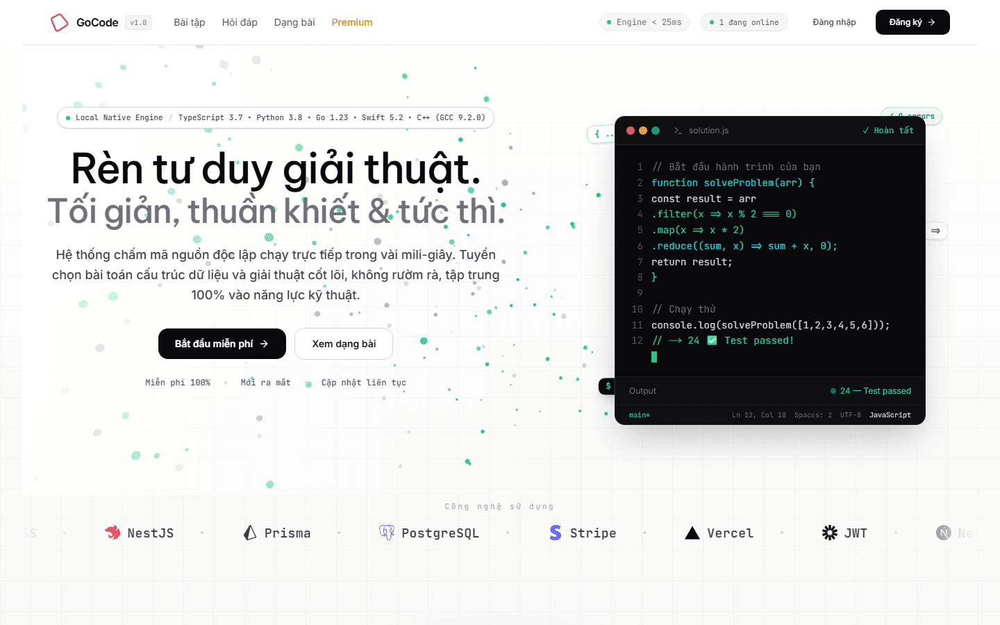 | 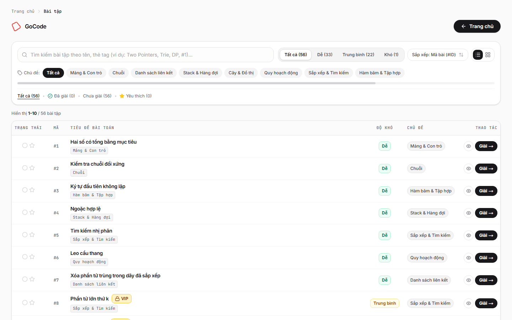 |

> Ảnh trong README chụp từ bản chạy local với **dữ liệu mồi** (tài khoản `@example.test`,
> số liệu analytics tự sinh). Không ảnh nào chứa dữ liệu người dùng thật.

## Sản phẩm gồm những gì

| App | Thư mục | Cổng local | Vai trò |
| --- | --- | --- | --- |
| FE | `FE/` | 3000 | Sân luyện: trang chủ, danh sách bài, trang bài + trình soạn thảo, Premium, tiến độ, hỏi đáp, đăng nhập |
| Admin | `admin/` | 3001 | Trang quản trị: dashboard, duyệt bài, học viên, bài nộp, hỏi đáp |
| BE | `be/` | 4000 | API NestJS: bài tập, chấm bài, tiến độ, phiên đăng nhập, Premium, admin, analytics |

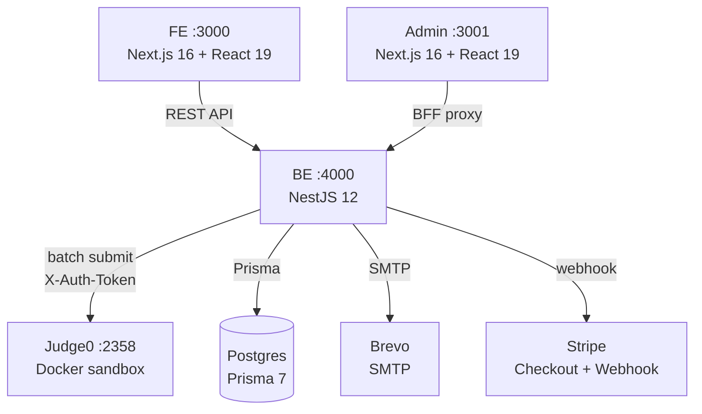

## Tính năng

### Sân luyện

- **Trình soạn thảo Monaco** với 8 ngôn ngữ: Python 3, JavaScript, TypeScript, C++ 17, PHP,
  Java, C#, Go (`FE/app/problem/[slug]/page.tsx`).
- **Chạy test mẫu và nộp bài.** Nộp bài thì BE gửi **test ẩn** lên Judge0; test ẩn bị cắt khỏi
  mọi response gửi cho client, kể cả khi tài khoản có VIP
  (`be/src/problems/problems.service.ts`). Mỗi bài tối đa 10 test ẩn.
- **Lịch sử nộp bài** theo từng bài, xem lại mã nguồn và kết quả từng lần nộp.

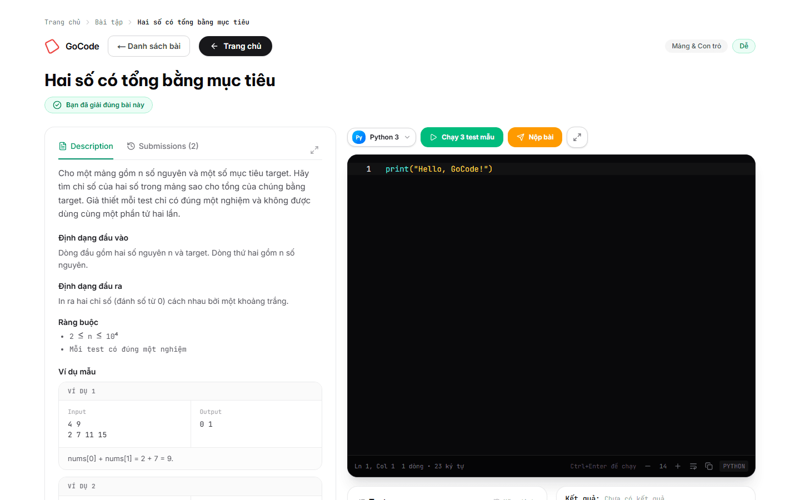

### Tiến độ

- **Streak** chuỗi ngày liên tiếp, **bản đồ nhiệt 35 ngày**, **12 huy hiệu** mở theo điều kiện
  (chuỗi ngày, số bài đã giải, số bài theo độ khó) — `be/src/progress/progress.service.ts`.
- **Đã giải / yêu thích** lưu trên server, đồng bộ giữa các máy.
- **Tiến độ theo 8 chủ đề** (mảng & con trỏ, chuỗi, danh sách liên kết, stack & hàng đợi, cây & đồ thị,
  quy hoạch động, sắp xếp & tìm kiếm, hàm bấm & tập hợp).

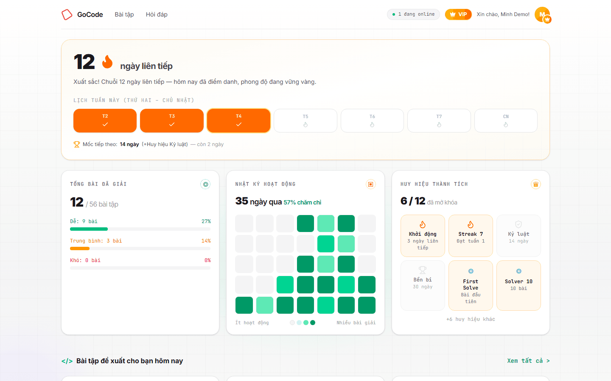

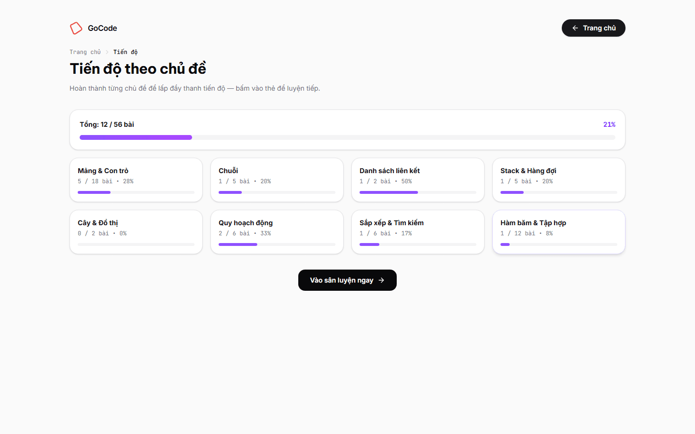

### Bài VIP và gói Premium

- **20 bài VIP** trong 56 bài, chỉ tài khoản `role = vip` mới mở được. Quyền quyết định bằng `role`
  đã ký trong access token, không đọc cột `isVip` của bài — `be/src/problems/vip-problem.policy.ts`.
  Người chưa nâng cấp chỉ thấy tên bài và lời mời nâng cấp, không lọt mô tả, test hay trình soạn thảo.

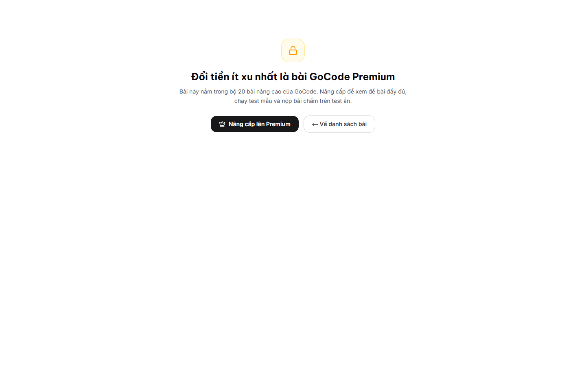

- **3 gói** (`FE/app/data/pricing.ts`): 200 ₫/ngày, 1.000 ₫/tháng, 2.000 ₫/năm. Thanh toán qua
  Stripe Checkout, giá và kỳ hạn gửi thẳng trong `price_data` nên không cần khai price ID.
- **Webhook idempotent**: mỗi event Stripe ghi vào bảng `StripeEvent`, nên retry webhook không
  gia hạn VIP hai lần. Hết hạn thì tự hạ VIP, không cần nhớ hủy.

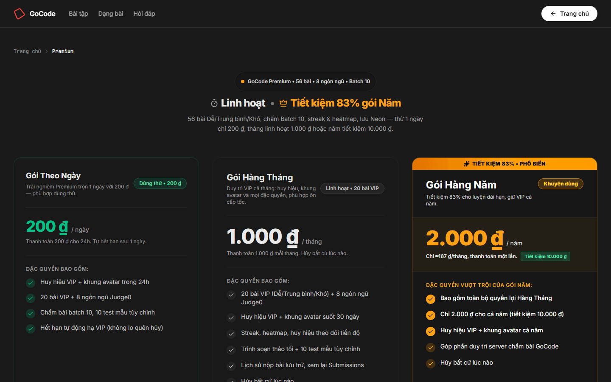

### Tài khoản

- **Đăng ký kèm xác minh email**, gửi lại link xác minh, và đặt lại mật khẩu qua email
  (`/register`, `/verify`, `/forgot-password`, `/reset-password`).
- **Đăng nhập bằng Google (OAuth 2.0 + PKCE S256)**. Nút Google ở cả `/sign-in` và `/sign-up`.
  Toàn bộ thỏa thuận nằm ở BE, FE chỉ có một liên kết tới `GET /api/auth/oauth/google/start`.
- Mật khẩu băm **bcrypt**; access token **RS256 hạn 15 phút**; refresh token hạn 30 ngày, xoay vòng
  theo từng thiết bị và chỉ giữ 10 phiên mới nhất.

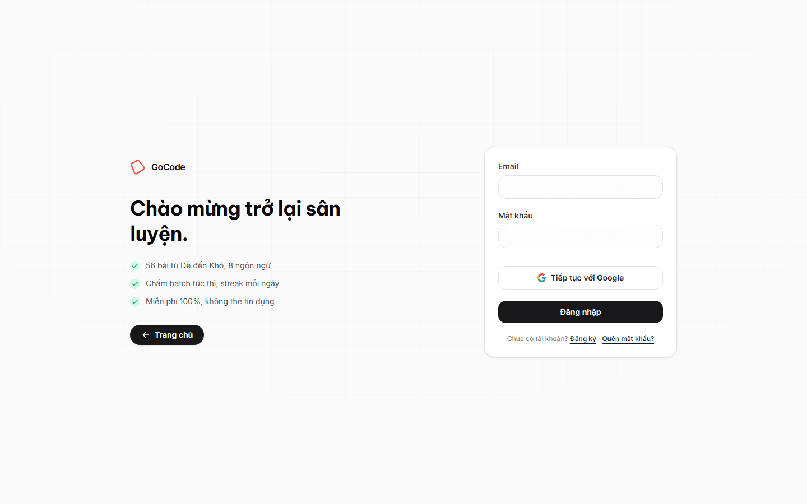

### Trang quản trị

- **Dashboard**: lượt truy cập 30 ngày, số online, tổng bài / hỏi đáp / bài nộp, biểu đồ chạy và nộp
  bài theo ngày, bài được nộp nhiều nhất, đăng nhập gần đây theo quốc gia.

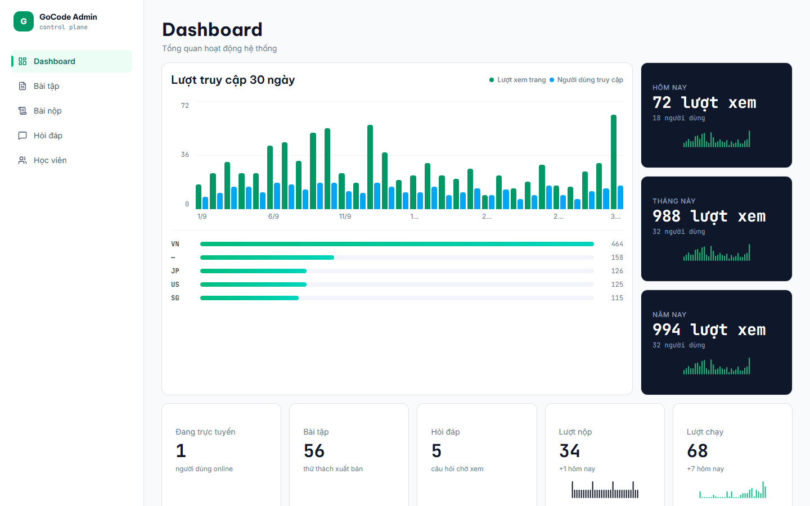

- **Học viên**: danh sách tài khoản, vai trò, tìm theo email / tên / ID.

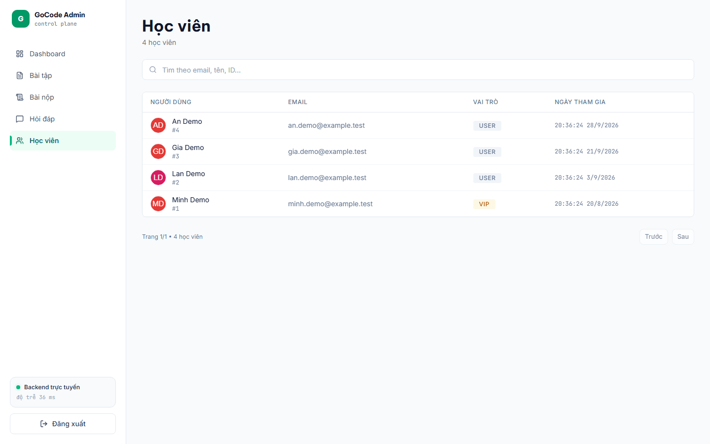

- **Bài nộp**: ai nộp bài nào, ngôn ngữ, kết quả, thời gian chạy, và xem lại mã nguồn.

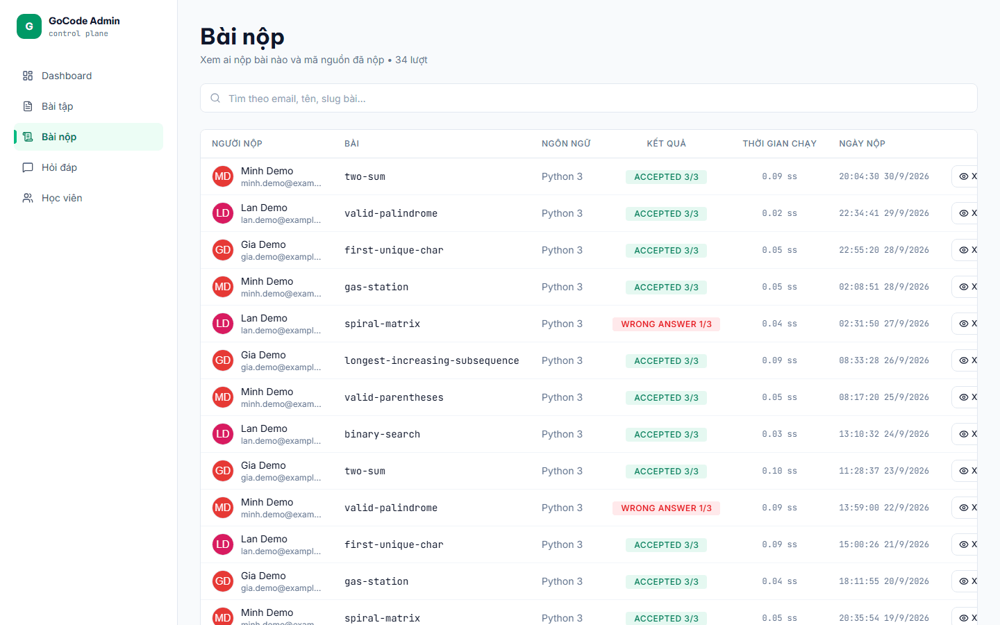

- **Bài tập**: tạo / sửa / xoá, duyệt xuất bản, gỡ xuất bản, bật hoặc gỡ cờ VIP cho từng bài.

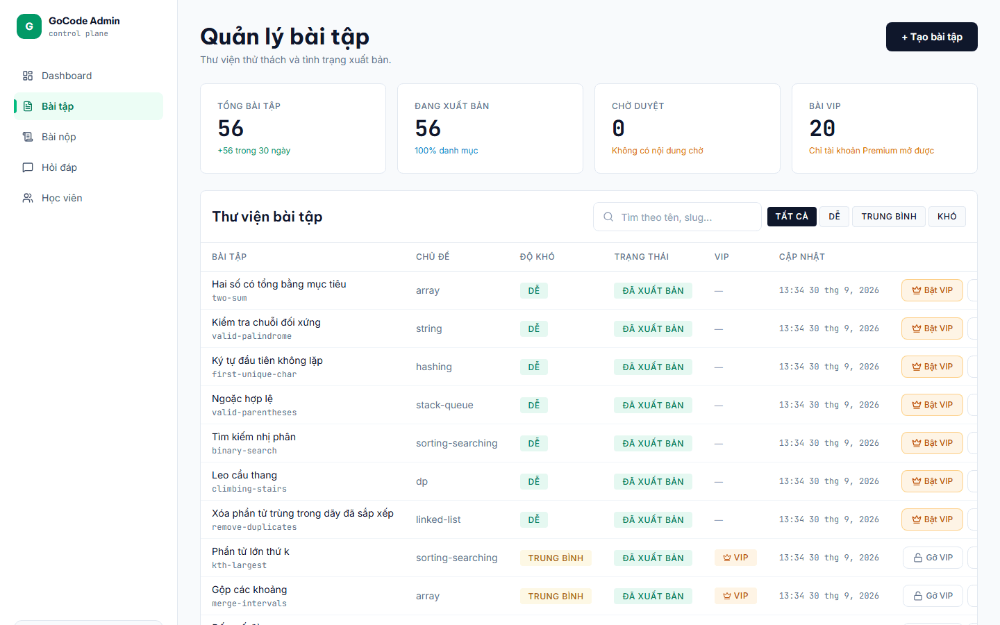

- **Hỏi đáp**: đọc câu hỏi của người dùng (kể cả khách chưa đăng nhập) và trả lời thẳng qua email.

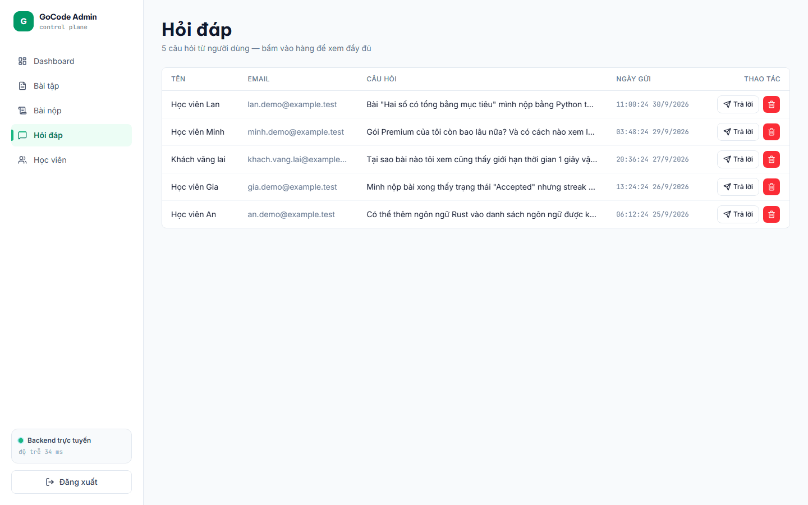

### Bảo mật

- Access token RS256 15 phút, refresh token xoay vòng theo thiết bị; admin ký cặp khoá RS256 riêng.
- Giới hạn tần suất: đăng nhập 30 lần/15 phút, đăng ký 20 lần/giờ, đăng nhập admin 5 lần/phút,
  gửi câu hỏi 5 lần/phút, nộp bài 30 lần/phút.
- Mọi input đi qua `ValidationPipe` với `whitelist`; route `PATCH /api/admin/problems/:slug/vip`
  còn bật `forbidNonWhitelisted` vì thân request đúng một trường.
- Analytics **không lưu IP thô**: chỉ lưu `sha256(IP_HASH_SALT + ":" + ip)`
  (`be/src/views/views.service.ts`), và chỉ đọc quốc gia qua header `x-vercel-ip-country`.
- Judge0: BE gắn header `X-Auth-Token` khi `JUDGE0_API_TOKEN` có giá trị. Để trống thì Judge0
  chạy public — ai cũng chấm được, nên production phải đặt token.

## Biến môi trường

Nguồn: `be/.env.example`, `FE/.env.example`, `admin/.env.example`. Không có giá trị bí mật nào
nằm trong repo.

### BE (`be/.env`)

| Biến | Bắt buộc | Lấy ở đâu / ghi chú |
| --- | --- | --- |
| `PORT` | không | Mặc định 4000. |
| `STRIPE_SECRET_KEY` | có | Bắt buộc cho trang Premium. |
| `STRIPE_WEBHOOK_SECRET` | có | Xác thực chữ ký webhook. Thiếu thì mọi webhook bị từ chối. |
| `FRONTEND_URL` | có | Origin của FE, dùng cho CORS và link trong mail. |
| `JUDGE0_URL` | có | URL Judge0, mặc định trong compose là `http://judge0-server:2358`. |
| `JUDGE0_API_TOKEN` | có | Token cho header `X-Auth-Token`. Rỗng = Judge0 public. |
| `USER_LOGIN` | có | Tài khoản SMTP Brevo. |
| `USER_PASS` | có | SMTP key Breho (`xsmtpsib-…`), không phải API key. |
| `MAIL_FROM` | có | Địa chỉ sender **đã xác minh** trên Brevo. |
| `ADMIN_EMAIL` / `ADMIN_PASSWORD` / `ADMIN_PASSWORD_HASH` | có | Tài khoản admin. Bcrypt hash tạo bằng `bcrypt.hashSync`. |
| `ADMIN_JWT_PRIVATE_KEY` / `ADMIN_JWT_PUBLIC_KEY` | có | Cặp RSA cho cookie admin (RS256). |
| `JWT_SECRET` | không | Fallback HS256 cho cookie admin cũ. |
| `GOOGLE_CLIENT_ID` / `GOOGLE_CLIENT_SECRET` / `GOOGLE_REDIRECT_URI` | có | Google Cloud Console → Credentials → OAuth client ID loại *Web application*. |


### FE (`FE/.env`)

| Biến | Ghi chú |
| --- | --- |
| `NEXT_PUBLIC_API_URL` | URL BE, mặc định `http://localhost:4000`. |

### Admin (`admin/.env`, `admin/.env.local`)

| Biến | Ghi chú |
| --- | --- |
| `BE_API_URL` | URL BE mà BFF proxy forward tới, chạy server-side. |
| `NEXT_PUBLIC_API_URL` | Dự phòng khi thiếu `BE_API_URL`. |
| `JWT_SECRET` | Chỉ dùng làm fallback HS256 khi verify RS256 thất bại (chỉ ở dev). |
| `ADMIN_JWT_PUBLIC_KEY` | Khoá công khai để `proxy.ts` verify cookie admin. |

## Phụ thuộc ngoài

| Phụ thuộc | Cần khi nào | Bắt buộc? |
| --- | --- | --- |
| **Postgres** | Mọi lúc — `DATABASE_URL` trỏ vào đây | Bắt buộc |
| **Judge0** (Docker) | Chạy test mẫu và nộp bài | Bắt buộc cho chấm code; danh sách bài vẫn xem được không cần |
| **Brevo** | Xác minh email, đặt lại mật khẩu, trả lời hỏi đáp | Không — thiếu thì các luồng đó log lỗi và bỏ qua gửi |
| **Google Cloud OAuth** | Nút "Tiếp tục với Google" | Không — thiếu thì nút báo `?oauth=failed` ngay khi bấm |
| **Stripe** | Gói Premium | Không — trang `/premium` vẫn hiện, chỉ không tạo được phiên thanh toán |

Judge0 local:

```bash
cd be && docker compose up -d      # judge0-server + 3 workers
docker compose restart judge0-server
```

Judge0 CE hỗ trợ auth ngay trong `judge0.conf`, không cần nginx:

```ini
AUTHN_TOKEN=<token-khoa-manh>
```

BE gắn header `X-Auth-Token: $JUDGE0_API_TOKEN` vào mọi request khi biến này có giá trị. CPU time
mặc định 2 giây (tối đa 5), RAM cố định 128MB cho mọi bài — `be/src/judge0/judge0.service.ts`.

## API chính

| Method & Path | Auth | Mô tả |
| --- | --- | --- |
| `GET /api/problems` | public | Danh sách bài đã xuất bản |
| `GET /api/problems/:slug` | public | Chi tiết bài (không kèm test ẩn) |
| `POST /api/problems/:slug/submit` | JWT cookie | Nộp bài: chấm test ẩn, ghi lịch sử + đánh dấu đã giải |
| `POST /api/submissions/batch` | JWT cookie | Gửi cả lô test lên Judge0 |
| `GET /api/submissions/batch?tokens=` | JWT cookie | Poll kết quả lô |
| `GET /api/history`, `POST /api/history` | JWT cookie | Lịch sử nộp bài |
| `GET /api/progress/dashboard` | JWT cookie | Streak, heatmap, huy hiệu, số bài đã giải |
| `GET /api/progress/solved`, `/favorites` | JWT cookie | Bài đã giải / yêu thích |
| `POST /api/auth/register`, `/login`, `/refresh`, `/logout` | public | Đăng ký và vòng đời phiên |
| `GET /api/auth/verify?token=` | public | Xác minh email từ link trong mail |
| `GET /api/auth/oauth/google/start`, `/callback` | public | Luồng OAuth Google |
| `POST /api/premium/checkout`, `/webhook` | JWT cookie / Stripe | Thanh toán |
| `GET /api/presence/online` | public | Số người đang online |
| `POST /api/qna` | public (giới hạn tần suất) | Gửi câu hỏi |
| `POST /api/admin/login` | admin | Đăng nhập admin |

## Cơ sở dữ liệu

Postgres qua Prisma 7. `be/prisma/schema.prisma` có 15 model: 14 bảng dùng thật và `Test` là
model stub chưa dùng.

| Bảng | Vai trò |
| --- | --- |
| `User` | Tài khoản: `role` (user/vip/admin), `vipExpiresAt`, `premiumPlan`, `avatarUrl` |
| `UserToken` | Refresh token theo thiết bị (xoay vòng, thu hồi từng thiết bị) |
| `UserAccount` | Liên kết OAuth — unique `(provider, providerUserId)` |
| `UserOAuthState` | State tạm của luồng OAuth, khoá theo hash |
| `ActivityDay` | Streak và bản đồ nhiệt — unique `(userId, date)` |
| `SolvedProblem` | Bài đã giải — unique `(userId, slug)` |
| `FavoriteProblem` | Bài yêu thích — unique `(userId, slug)` |
| `UserBadge` | Huy hiệu đã mở — unique `(userId, badgeId)` |
| `Problem` | Bài tập: `isVip`, `tests`, `hiddenTests`, `starterCodes`, `status` |
| `Submission` | Lịch sử nộp bài: `status`, `passed`, `time`, `memory`, `sourceCode` |
| `QnaQuestion` | Câu hỏi hỗ trợ, `userId` nullable để khách không cần đăng nhập |
| `StripeEvent` | Event Stripe đã xử lý — idempotency chống gia hạn VIP hai lần |
| `PageView` | Analytics trang — `ipHash` (không lưu IP thô) |
| `LoginEvent` | Lượt đăng nhập — `ipHash`, `country` |

Quan hệ chính: `User` 1—N các bảng dữ liệu. `onDelete: Cascade` cho dữ liệu thuộc user;
`QnaQuestion`, `PageView`, `LoginEvent` để lại dòng (nullable `userId`) khi user bị xoá.

## ERD

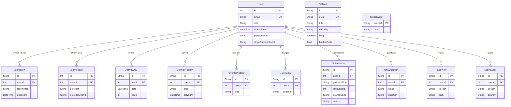

## API Collection

### Auth

| Method | Path | Body | Response |
| ------ | ---- | ---- | -------- |
| `POST` | `/api/auth/register` | `{ email, password, name? }` | `200 { message }` |
| `POST` | `/api/auth/login` | `{ email, password }` | `200 { user, expiresIn }` + cookies |
| `POST` | `/api/auth/refresh` | — (cookie `refresh`) | `200 { user, expiresIn }` |
| `POST` | `/api/auth/logout` | — (cookie `refresh`) | `200 { ok }` |
| `GET` | `/api/auth/me` | — (cookie `session`) | `200 { user, expiresIn }` / `401` |
| `GET` | `/api/auth/verify?token=` | — | `200 { user, expiresIn }` |
| `POST` | `/api/auth/forgot-password` | `{ email }` | `200 { message }` |
| `POST` | `/api/auth/reset-password` | `{ token, password }` | `200 { ok }` |

### OAuth

| Method | Path | Response |
| ------ | ---- | -------- |
| `GET` | `/api/auth/oauth/google/start?redirect_to=` | `302` → Google |
| `GET` | `/api/auth/oauth/google/callback?code&state` | `302` → FE |

### Problems

| Method | Path | Auth | Response |
| ------ | ---- | ---- | -------- |
| `GET` | `/api/problems` | public | `200 Problem[]` |
| `GET` | `/api/problems/:slug` | public | `200 Problem` / `404` |
| `POST` | `/api/problems/:slug/submit` | JWT | `200 Submission` |

### Submissions

| Method | Path | Auth | Response |
| ------ | ---- | ---- | -------- |
| `POST` | `/api/submissions/batch` | JWT | `200 { tokens }` |
| `GET` | `/api/submissions/batch?tokens=` | JWT | `200 Submission[]` |
| `GET` | `/api/history` | JWT | `200 Submission[]` |
| `POST` | `/api/history` | JWT | `200 Submission` |

### Progress

| Method | Path | Auth | Response |
| ------ | ---- | ---- | -------- |
| `GET` | `/api/progress/dashboard` | JWT | `200 { streak, heatmap, badges, solved }` |
| `GET` | `/api/progress/solved` | JWT | `200 { slugs }` |
| `GET` | `/api/progress/favorites` | JWT | `200 { slugs }` |
| `POST` | `/api/progress/favorites` | JWT | `200 { ok }` |

### Premium

| Method | Path | Auth | Response |
| ------ | ---- | ---- | -------- |
| `POST` | `/api/premium/checkout` | JWT | `200 { url }` |
| `GET` | `/api/premium/status` | JWT | `200 { role, vipExpiresAt }` |
| `POST` | `/api/premium/webhook` | Stripe | `200 { received }` |

### Admin

| Method | Path | Auth | Response |
| ------ | ---- | ---- | -------- |
| `POST` | `/api/admin/login` | — | `200 { ok }` + cookie |
| `GET` | `/api/admin/users` | admin | `200 User[]` |
| `PATCH` | `/api/admin/problems/:slug/vip` | admin | `200 { ok }` |
| `POST` | `/api/admin/qna/:id/reply` | admin | `200 { ok }` |

### Other

| Method | Path | Auth | Response |
| ------ | ---- | ---- | -------- |
| `GET` | `/api/presence/online` | public | `200 { count }` |
| `POST` | `/api/qna` | public | `200 { ok }` |

## Performance Testing

Tool: k6 v2.2.0
Environment: NestJS + PostgreSQL (local), Judge0 (Docker)
Machine: AMD Ryzen 7 5800U, 14GB RAM, Windows 11 (local) / VM.Standard.E2.1.Micro: 1 OCPU AMD EPYC, 1GB RAM, 480 Mbps, Ubuntu 22.04 (Oracle Cloud free tier)
Test date: 2026-10-01
Commit: [Git commit SHA]
Warm-up: 5 VUs / 30s trước mỗi lần test chính

### Scenarios
- Public read: 30 VUs, sustain for 120 seconds (3 runs)
- Judge0 submit: 5 VUs, sustain for 60 seconds

### Thresholds
- HTTP error rate < 1%
- API p95 latency < 500 ms
- Checks pass rate > 99%

### Results
| Run | VUs | Duration | Requests | RPS | p50 | p90 | p95 | p99 | Error rate | Status |
|---|---:|---:|---:|---:|---:|---:|---:|---|
| 1 | 30 | 120s | 2398 | 19.83 | 1.07ms | 1.73ms | 2.46ms | 614.03ms | 0% | PASS |
| 2 | 30 | 120s | 2374 | 19.61 | 1.07ms | 1.73ms | 2.16ms | 990.57ms | 0% | PASS |
| 3 | 30 | 120s | 2377 | 19.58 | 0.92ms | 1.58ms | 1.75ms | 797.27ms | 0% | PASS |
| **Avg** | **30** | **120s** | **2383** | **19.67** | **1.02ms** | **1.68ms** | **2.12ms** | **800.62ms** | **0%** | **PASS** |

### Judge0 Results
| Metric | Value |
|--------|-------|
| VUs | 5 |
| Duration | 60s |
| Requests | 276 |
| RPS | 4.41 |
| p50 | 202ms |
| p90 | 923ms |
| p95 | 1.03s |
| p99 | 1.62s |
| Error rate | 0% |
| Status | PASS |

### Script Path
- `be/tests/performance/problems-load-test.js`
- `be/tests/performance/judge0-load-test.js`

### Reproduce
```bash
# Public read test
cd be && pnpm start:dev
k6 run --vus 30 --duration 120s --summary-trend-stats "avg,min,med,max,p(90),p(95),p(99)" -e BASE_URL=http://localhost:4000 tests/performance/problems-load-test.js

# Judge0 test (cần Judge0 chạy)
cd be && docker compose up -d judge0-server judge0-workers
k6 run --vus 5 --duration 60s --summary-trend-stats "avg,min,med,max,p(90),p(95),p(99)" -e BASE_URL=http://localhost:4000 -e TEST_EMAIL=k6@test.com -e TEST_PASSWORD=k6test123 tests/performance/judge0-load-test.js
```

### Side Effects & Cleanup
- **Public read**: chỉ GET, không ghi DB, không cần cleanup
- **Judge0 test**: tạo user `k6@test.com` (nếu chưa có), ghi submission vào DB. Cleanup:
  ```sql
  DELETE FROM "Submission" WHERE "userId" = (SELECT id FROM "User" WHERE email = 'k6@test.com');
  DELETE FROM "User" WHERE email = 'k6@test.com';
  ```

## Screenshots

| Trang chủ | Danh sách bài | Trang bài |
| --- | --- | --- |
|  |  |  |

| Premium | Đăng nhập | Admin |
| --- | --- | --- |
|  |  |  |

## API Documentation

API collection đầy đủ xem ở section [API Collection](#api-collection) phía trên. Swagger UI chưa được tích hợp — dùng Postman hoặc curl với các endpoint đã liệt kê.

## 1. Product Overview

GoCode là nền tảng luyện thuật toán cho học sinh/sinh viên Việt Nam. Người dùng đọc đề, viết code trong trình soạn thảo Monaco, nộp bài và nhận kết quả chấm tức thì từ Judge0. Hệ thống lưu tiến độ (streak, heatmap, huy hiệu) để giữ động lực học mỗi ngày.

**Live demo:** https://go-code-vn.vercel.app/

## 2. Architecture Diagram

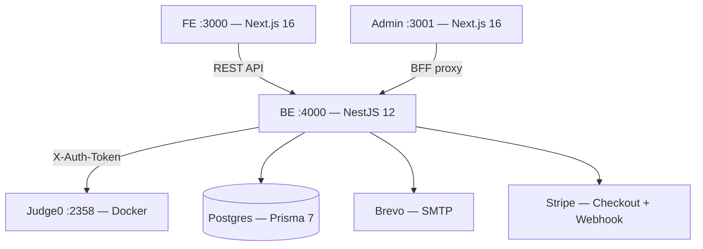

## 3. Service Deployment Diagram

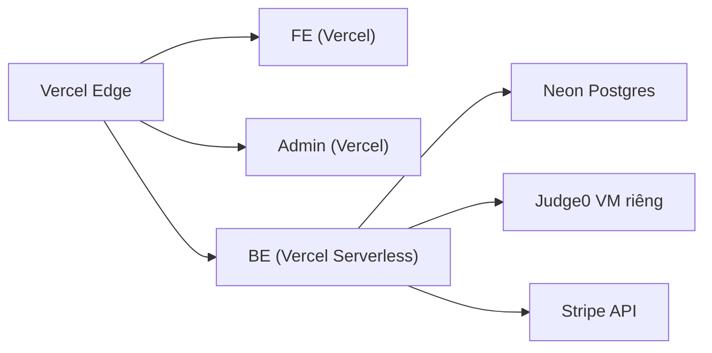

- **FE/Admin/BE**: 3 project Vercel riêng, deploy độc lập
- **Postgres**: Neon (serverless, pooler + direct connection)
- **Judge0**: VM riêng chạy Docker, BE gọi qua `JUDGE0_URL` + `X-Auth-Token`

## 4. Main User Flows

### Luyện tập
1. Đăng nhập → xem danh sách bài → chọn bài → viết code → chạy test mẫu → nộp bài → xem kết quả
2. Bài VIP bị khoá → hiện nút nâng cấp → thanh toán → mở khoá ngay

### Premium
1. Chọn gói → Stripe Checkout → webhook cấp VIP → hết hạn tự hạ

### Admin
1. Đăng nhập admin → duyệt bài → bật/tắt VIP → trả lời QNA qua email

## 5. Technology Choices & Trade-offs

| Lựa chọn | Trade-off |
|----------|-----------|
| Next.js 16 (App Router) | SSR + client components, học phí cao hơn Pages Router |
| NestJS 12 | Nặng hơn Express nhưng DI + module rõ ràng |
| Prisma 7 | Type-safe, chậm hơn raw SQL ở query phức tạp |
| Judge0 self-hosted | Kiểm soát được giới hạn, tốn VM riêng |
| Stripe Checkout | Không cần quản lý form thanh toán, phí 2.9% + 30¢ |
| Custom auth (không Clerk/Auth0) | Tự quản lý hoàn toàn, không phụ thuộc bên thứ 3 |

## 6. Authentication/Token Design

- **Access token**: JWT RS256, 15 phút, cookie `httpOnly` + `Secure` + `SameSite=None`
- **Refresh token**: 30 ngày, xoay vòng theo thiết bị, lưu hash trong `UserToken`
- **Thu hồi**: logout xoá dòng `UserToken` → refresh token cũ không dùng được
- **Đa thiết bị**: mỗi thiết bị 1 dòng, đăng nhập mới không đuổi thiết bị cũ
- **OAuth Google**: PKCE S256, state lưu DB (hash), không lưu plaintext

## 7. Stripe Webhook/Idempotency Design

- **Vấn đề**: Stripe retry event khi timeout → gia hạn VIP hai lần
- **Giải pháp**: bảng `StripeEvent` với `eventId` là PK
- **Cơ chế**: `stripeEvent.create()` → P2002 unique violation → bỏ qua event trùng
- **Code**: `be/src/premium/premium.service.ts:294`

## 8. Judge0 Execution Workflow & Security

### Workflow
1. FE gọi `POST /api/submissions` với `{ language_id, source_code }`
2. BE gửi lên Judge0 → nhận `token`
3. FE poll `GET /api/submissions/:token` → nhận kết quả

### Security Constraints
- **Container**: mỗi submission 1 container tạm, xong xóa
- **Resource limits**: CPU 2s, RAM 128MB, pids limit
- **Network isolation**: container không có network access
- **Read-only FS**: không ghi được ra host
- **Non-root**: process chạy với quyền thấp
- **Auth**: header `X-Auth-Token` (token trong `judge0.conf`)

## 9. CI/CD Workflow

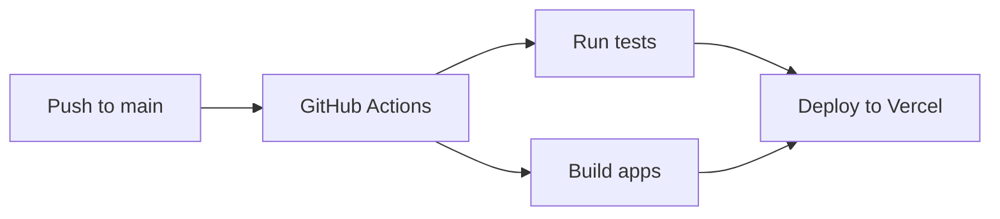

- **Test**: `pnpm --dir be test` + `pnpm --dir FE test`
- **Build**: Vercel tự build khi push
- **Deploy**: FE, Admin, BE deploy độc lập

## 10. Test Strategy & Coverage

| Layer | Tool | Tests | Coverage |
|-------|------|-------|----------|
| Unit/Integration | Vitest | 744 | 86.5% lines |
| E2E | Playwright | 13 | — |
| Performance | k6 | 2 scenarios | — |

**Thresholds**: lines ≥ 80%, branches ≥ 75%

## 11. Performance Test Profile

### Environment
- **Machine**: AMD Ryzen 7 5800U, 14GB RAM, Windows 11
- **VM**: VM.Standard.E2.1.Micro (1 OCPU, 1GB RAM, Ubuntu 22.04)
- **Warm-up**: 5 VUs / 30s trước mỗi lần test

### Results (30 VUs, 120s, 3 runs)
| Metric | Value |
|--------|-------|
| RPS | 19.67 |
| p50 | 1.02ms |
| p90 | 1.68ms |
| p95 | 2.12ms |
| p99 | 800ms |
| Error rate | 0% |

### Limitations
- p99 cao do GC/cold start (Node.js)
- Chỉ test public read, không test submit/auth
- Local environment, không phải production traffic

## 12. Local Setup with Docker/.env.example

```bash
# 1. Cài dependencies
pnpm --dir be install && pnpm --dir FE install && pnpm --dir admin install

# 2. Copy env
cp be/.env.example be/.env
cp FE/.env.example FE/.env
cp admin/.env.example admin/.env

# 3. Start Postgres + Judge0
cd be && docker compose up -d

# 4. Migrate + seed
pnpm --dir be exec prisma migrate deploy
pnpm --dir be exec node scripts/seed-problems.ts

# 5. Run
pnpm dev
```

## 13. Screenshots

| Trang chủ | Danh sách bài | Trang bài |
| --- | --- | --- |
|  |  |  |

| Premium | Đăng nhập | Admin |
| --- | --- | --- |
|  |  |  |

## Tài liệu khác

- `PRODUCT.md` — mục đích sản phẩm, đối tượng, nguyên tắc sản phẩm.
- `DESIGN.md` — hệ thống hình ảnh.
- `docs/superpowers/specs/` — thiết kế tính năng: custom auth, Google OAuth, admin, UI.
- `be/src/**/*.spec.ts` — test chi tiết từng service, là tài liệu hành vi đáng tin hơn README.
