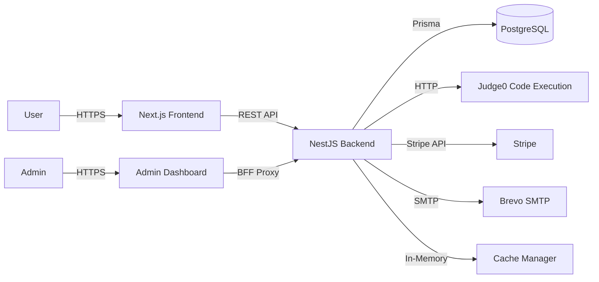
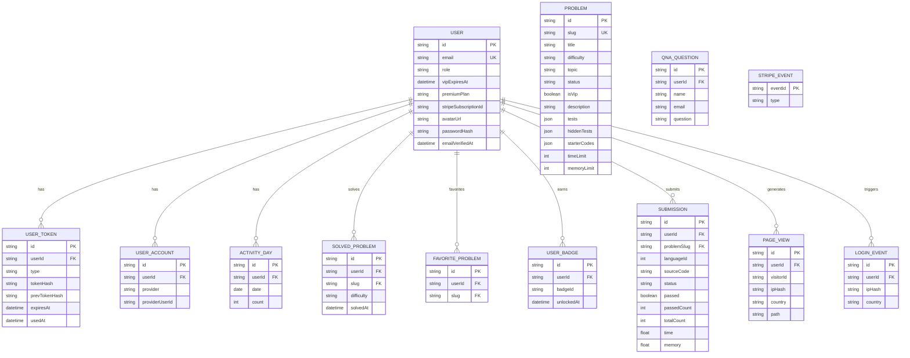

# GoCode — Algorithm Practice Platform (coding-dev-lab)

> A Vietnamese-language algorithm practice platform where users solve programming problems, submit code, and receive automated evaluation results via Judge0.

---

## Overview

GoCode is a full-stack algorithm practice platform for students. Users read problem statements, write code in a Monaco editor, submit solutions, and receive instant judging results from Judge0. The platform gamifies learning with streaks, heatmaps, and badges, and monetizes via a Premium/VIP subscription tier (Stripe).

**Production URL:** [https://go-code-vn.vercel.app/](https://go-code-vn.vercel.app/)

---

## Features

### Core Platform
- Problem library across 8 topics (Arrays & Pointers, Strings, Linked Lists, Stack & Queue, Trees & Graphs, Dynamic Programming, Sorting & Searching, Hashing & Sets)
- Code editor with Monaco Editor and syntax highlighting
- Instant judging via Judge0 (CPU 2s, RAM 128MB limits)
- Batch testing — submit up to 10 hidden tests at once with fail-fast polling
- Submission history (last 50 per problem)

### Gamification
- Streak system (consecutive days with activity, Vietnam timezone UTC+7)
- Activity heatmap (35-day visualization)
- 12 badges unlocked by streak length, problems solved, and difficulty milestones
- Solved & favorites (server-side storage, synced across devices)

### Authentication
- Email/password registration with email verification (24-hour token)
- Google OAuth 2.0 with PKCE S256
- JWT RS256 access tokens (15-min expiry) + refresh tokens (30-day, per-device rotation, max 10 sessions)
- Password reset via email (1-hour expiry)
- Timing attack prevention (dummy bcrypt hash for non-existent users)

### Premium/VIP
- 3 plans: 200 VND/day, 1,000 VND/month, 2,000 VND/year
- Stripe Checkout with VND currency
- Webhook idempotency via `StripeEvent` table
- Auto-downgrade on expiry (sweep every 60 minutes)
- VIP-only problems (per-problem flag)

### Admin Dashboard
- 30-day analytics, online count, daily charts, top problems, recent logins by country
- User management (list, search by email/name/ID)
- Problem management (CRUD, publish/unpublish, VIP flag toggle)
- Submission review (view all submissions with source code)
- Q&A management (read questions, reply via email)

### Q&A Support
- Public submission (guests can submit questions, rate limited: 5/minute)
- Admin reply via Brevo SMTP with HTML template

### Analytics & Presence
- Page view tracking (fire-and-forget, IP hashed with salt)
- Login analytics (country detection via Vercel header or ip-api.com)
- Online presence (in-memory heartbeat with 45-second TTL)

---

## Tech Stack

### Frontend
- **Framework:** Next.js 16.3 (App Router) + React 19.2
- **Language:** TypeScript
- **UI Library:** shadcn/ui, Tailwind CSS 4, lucide-react
- **State Management:** SWR 2 (data fetching)
- **Code Editor:** Monaco Editor (@monaco-editor/react)
- **3D/Graphics:** Three.js, @react-three/fiber, @react-three/drei
- **Animation:** Framer Motion 13, GSAP 3

### Backend
- **Framework:** NestJS 12 (ESM)
- **Language:** TypeScript
- **ORM:** Prisma 7
- **Authentication:** jose (JWT RS256), bcryptjs
- **Validation:** class-validator, class-transformer
- **Code Execution:** Judge0 (self-hosted Docker)
- **Payments:** Stripe 18
- **Email:** Nodemailer 10 (Brevo SMTP)
- **Caching:** @nestjs/cache-manager (in-memory)
- **Rate Limiting:** Custom ThrottleGuard (in-memory, per-IP per-route)

### Database
- **Database:** PostgreSQL (Neon Postgres serverless)

### Infrastructure
- **Package Manager:** pnpm 10.15 (workspace)
- **Deployment:** Vercel (3 separate projects: FE, Admin, BE)
- **Containerization:** Docker Compose (PostgreSQL + Judge0)
- **Testing:** Vitest 4, Supertest, Playwright 16, k6
- **Linting:** oxlint

---

## Architecture



The application is a monorepo with three deployable applications: Frontend (FE), Admin Dashboard, and Backend (BE).

---

## Request Flow

### Authentication Flow

```text
User
  ↓
POST /api/auth/login
  ↓
AuthController
  ↓
AuthService.login()
  ↓
UserRepository.findByEmail()
  ↓
Prisma → PostgreSQL
  ↓
bcryptjs.compare()
  ↓
Generate JWT RS256 access token (15 min)
  ↓
Generate refresh token (30 days, hashed)
  ↓
Set httpOnly + Secure + SameSite=None cookies
  ↓
Client
```

### Code Submission Flow

```text
User
  ↓
POST /api/problems/:slug/submit
  ↓
AuthGuard (JWT verification)
  ↓
ProblemController.submit()
  ↓
ProblemService.submit()
  ↓
Judge0Service.submit()
  ↓
POST /submissions (Judge0 API)
  ↓
Poll GET /submissions/:token
  ↓
Normalize output (CRLF→LF, trim)
  ↓
Compare with expected output
  ↓
Save Submission to PostgreSQL
  ↓
Return result to client
```

---

## Backend Architecture

The backend follows NestJS modular architecture:

```text
Controller (REST API)
    ↓
Guard (AuthGuard, ThrottleGuard)
    ↓
Service (Business Logic)
    ↓
Repository / Prisma (Data Access)
    ↓
Database (PostgreSQL)
```

### Modules
- `auth` — Authentication (JWT, OAuth, tokens, refresh rotation)
- `judge0` — Code execution service (submit, poll, batch)
- `problems` — Problem management (CRUD, VIP policy, caching)
- `submissions` — Submission history and judging
- `progress` — Streaks, badges, heatmap
- `premium` — Stripe payments and VIP management
- `admin` — Admin panel API
- `qna` — Q&A support
- `views` — Page view analytics
- `presence` — Online user tracking
- `activity` — Daily activity tracking
- `database` — Prisma database service
- `common` — Throttle guard, cache config, geo utilities

---

## Database Design



---

## Database Design

**PostgreSQL** via Prisma 7 — 14 tables, 3 schemas (public, auth, app).

### Schema Overview

| Schema | Tables | Purpose |
|--------|--------|---------|
| `public` | `User`, `UserToken`, `UserAccount`, `UserOAuthState` | Core identity & sessions |
| `app` | `Problem`, `Submission`, `SolvedProblem`, `FavoriteProblem`, `UserBadge`, `ActivityDay` | Learning data |
| `analytics` | `PageView`, `LoginEvent`, `StripeEvent` | Observability |

### Entity Relationships

```
User (1) ───< UserToken (refresh tokens, per-device)
User (1) ───< UserAccount (OAuth links)
User (1) ───< UserOAuthState (transient, TTL 10min)
User (1) ───< Problem (author)
User (1) ───< Submission
User (1) ───< SolvedProblem
User (1) ───< FavoriteProblem
User (1) ───< UserBadge
User (1) ───< ActivityDay
User (1) ───< PageView (nullable userId for guests)
User (1) ───< LoginEvent (nullable userId for guests)
```

### Key Indexes

| Table | Index | Reason |
|-------|-------|--------|
| `User` | `email` UNIQUE | Login lookup |
| `UserToken` | `(userId, type)` | Session queries |
| `UserToken` | `tokenHash` | Refresh token lookup |
| `UserAccount` | `(provider, providerUserId)` UNIQUE | OAuth account matching |
| `UserOAuthState` | `expiresAt` | Sweep expired states |
| `Problem` | `slug` UNIQUE | Problem lookup |
| `Submission` | `(userId, problemSlug)` | User's submissions for a problem |
| `SolvedProblem` | `(userId, slug)` UNIQUE | Prevent duplicate solves |
| `ActivityDay` | `(userId, date)` UNIQUE | Streak calculation |
| `PageView` | `(ipHash, createdAt)` | Unique visitor counting |
| `LoginEvent` | `(userId, createdAt)` | Login history |

### Design Decisions

- **Soft deletes**: `User.deletedAt` — preserve data integrity for foreign keys
- **UUID vs Int**: `User.id` is Int (fast joins), other tables use UUID (distributed-safe)
- **JSON columns**: `Problem.tests`, `Problem.hiddenTests` — flexible schema, validated in app layer
- **Nullable analytics**: `PageView.userId`, `LoginEvent.userId` nullable — track guests without fake users
- **TTL cache**: `UserOAuthState` has `expiresAt` index for periodic cleanup
- **Idempotency**: `StripeEvent.eventId` PK prevents duplicate webhook processing

---

## API

### Authentication (`/api/auth`)

| Method | Endpoint | Auth | Description |
|--------|----------|------|-------------|
| POST | `/register` | Public | Register (20/hr limit) |
| POST | `/login` | Public | Login (30/15min limit) |
| POST | `/refresh` | Cookie | Refresh session (100/min) |
| POST | `/logout` | Cookie | Logout current device |
| POST | `/logout-all` | JWT | Logout all devices |
| POST | `/forgot-password` | Public | Request reset (20/hr) |
| POST | `/resend-verification` | Public | Resend verification (20/hr) |
| POST | `/reset-password` | Public | Reset with token (20/hr) |
| GET | `/verify?token=` | Public | Verify email (20/min) |
| GET | `/me` | JWT | Current user |
| GET | `/oauth/google/start` | Public | Start Google OAuth (20/hr) |
| GET | `/oauth/google/callback` | Public | Google OAuth callback (20/hr) |

### Problems (`/api/problems`)

| Method | Endpoint | Auth | Description |
|--------|----------|------|-------------|
| GET | `/` | Optional | List published problems |
| GET | `/:slug` | Optional | Problem detail (VIP-gated) |
| POST | `/:slug/submit` | JWT | Submit solution (10/min) |

### Submissions (`/api/submissions`, `/api/history`)

| Method | Endpoint | Auth | Description |
|--------|----------|------|-------------|
| POST | `/api/submissions` | JWT | Single submission (20/min) |
| POST | `/api/submissions/batch` | JWT | Batch submit (20/min) |
| GET | `/api/submissions/batch?tokens=` | JWT | Poll batch (100/min) |
| GET | `/api/submissions/:token` | JWT | Get submission result |
| GET | `/api/history` | JWT | User submission history |
| POST | `/api/history` | JWT | Create submission record (30/min) |

### Progress (`/api/progress`)

| Method | Endpoint | Auth | Description |
|--------|----------|------|-------------|
| GET | `/dashboard` | JWT | Streak, heatmap, badges, solved |
| GET | `/solved` | JWT | Solved problems |
| GET | `/badges` | JWT | Badge list |
| POST | `/solve` | JWT | Mark problem solved |
| GET | `/favorites` | JWT | Favorite problems |
| POST | `/favorites` | JWT | Add favorite |
| DELETE | `/favorites/:slug` | JWT | Remove favorite |

### Premium (`/api/premium`)

| Method | Endpoint | Auth | Description |
|--------|----------|------|-------------|
| POST | `/checkout` | JWT | Create Stripe checkout |
| GET | `/status` | JWT | VIP status |
| POST | `/grant-vip` | Admin | Grant VIP to user |
| POST | `/cancel-vip` | Admin | Cancel VIP |
| POST | `/webhook` | Stripe | Stripe webhook |
| POST | `/check-expired` | JWT | Check/downgrade expired VIP |

### Admin (`/api/admin`)

| Method | Endpoint | Auth | Description |
|--------|----------|------|-------------|
| POST | `/login` | Public | Admin login (5/min) |
| POST | `/refresh` | Cookie | Refresh admin token (100/min) |
| POST | `/logout` | Cookie | Admin logout |
| GET | `/me` | Admin | Current admin |
| GET | `/stats` | Admin | Dashboard stats |
| GET | `/analytics/views` | Admin | View analytics |
| GET | `/analytics/views/recent` | Admin | Recent views |
| GET | `/analytics/logins` | Admin | Login analytics |
| GET | `/qna` | Admin | List Q&A |
| DELETE | `/qna/:id` | Admin | Delete Q&A |
| POST | `/qna/:id/reply` | Admin | Reply via email |
| GET | `/users` | Admin | List users |
| GET | `/submissions` | Admin | List submissions |
| GET | `/problems` | Admin | List all problems |
| GET | `/problems/:slug` | Admin | Problem detail |
| POST | `/problems` | Admin | Create problem |
| PUT | `/problems/:slug` | Admin | Update problem |
| DELETE | `/problems/:slug` | Admin | Delete problem |
| POST | `/problems/:slug/approve` | Admin | Publish problem |
| POST | `/problems/:slug/unpublish` | Admin | Unpublish problem |
| PATCH | `/problems/:slug/vip` | Admin | Toggle VIP flag |

### Other

| Method | Endpoint | Auth | Description |
|--------|----------|------|-------------|
| GET | `/api/presence/online` | Public | Online count |
| POST | `/api/presence/heartbeat` | Public | Heartbeat |
| POST | `/api/views/track` | Public | Track page view (30/min) |
| POST | `/api/qna` | Public | Submit question (5/min) |
| POST | `/api/activity/login` | JWT | Record login |
| POST | `/api/activity/run` | JWT | Record run |
| GET | `/api/activity/me` | JWT | Activity map |

---

## Authentication & Authorization

```text
User
  ↓
POST /api/auth/login
  ↓
AuthController
  ↓
AuthService.login()
  ↓
UserRepository.findByEmail()
  ↓
Prisma → PostgreSQL
  ↓
bcryptjs.compare()
  ↓
Generate JWT RS256 access token (15 min)
  ↓
Generate refresh token (30 days, hashed)
  ↓
Set httpOnly + Secure + SameSite=None cookies
  ↓
Client
```

- **Access Tokens:** JWT RS256, 15-minute expiry, `httpOnly` + `Secure` + `SameSite=None` cookies
- **Refresh Tokens:** 30-day expiry, per-device rotation, max 10 concurrent sessions, 30-second rotation grace period
- **OAuth:** Google OAuth 2.0 with PKCE S256, state stored hashed in DB
- **Timing Attack Prevention:** `burnCompare` with dummy bcrypt hash for non-existent users
- **Login CSRF Protection:** `g_oauth_state` cookie bound to browser
- **Account Linking:** Google accounts matched by `sub` (not email), with conflict detection
- **Admin Auth:** Separate RS256 JWT with 30-min access + 7-day refresh, separate cookie namespace

---

## Important Technical Decisions

### Why Judge0 for Code Execution?

**Problem:** Executing untrusted user code safely requires isolation, resource limits, and multi-language support.

**Decision:** Use Judge0 (self-hosted Docker) as the code execution engine.

**Reason:** Judge0 provides sandboxed execution, supports 60+ languages, and offers configurable CPU/memory limits via a simple HTTP API.

**Trade-off:** Requires self-hosting and monitoring the Judge0 service separately.

### Why JWT RS256 over HS256?

**Problem:** Symmetric signing (HS256) requires the same secret on all services, making key rotation and service-to-service trust harder.

**Decision:** Use RS256 (RSA asymmetric) for JWT signing.

**Reason:** Allows separate services to verify tokens using only the public key, enabling better key management and service isolation.

**Trade-off:** Slightly higher computational cost for signing/verification compared to symmetric algorithms.

### Why Refresh Token Rotation?

**Problem:** Stolen refresh tokens could be used indefinitely to generate new access tokens.

**Decision:** Implement per-device refresh token rotation with a 30-second grace period.

**Reason:** Each refresh token can only be used once; a new token is issued on each refresh. The grace period handles concurrent requests.

**Trade-off:** Increases complexity in token management and requires tracking token state in the database.

### Why In-Memory Caching?

**Problem:** Frequently accessed problem lists and details can increase database load.

**Decision:** Use `@nestjs/cache-manager` with in-memory store and TTL-based invalidation.

**Reason:** Reduces repeated database queries for read-heavy endpoints with configurable TTL (list: 60s, detail: 5min).

**Trade-off:** Cache is not shared across multiple instances; invalidation is local to each instance.

### Why Stripe Webhook Idempotency?

**Problem:** Stripe may deliver the same webhook event multiple times, causing duplicate processing.

**Decision:** Store Stripe event IDs as primary keys in the `StripeEvent` table.

**Reason:** Duplicate events are rejected at the database level, ensuring idempotent processing.

**Trade-off:** Requires an extra database table and lookup on each webhook.

---

## Error Handling & Validation

- **Input Validation:** `class-validator` + `class-transformer` with `ValidationPipe` (whitelist mode)
- **Rate Limiting:** Custom `ThrottleGuard` (in-memory, per-IP per-route)
- **Error Response:** Standard HTTP status codes with error messages
- **Timing Attack Prevention:** Dummy bcrypt hash comparison for non-existent users

---

## Testing

- **Unit Tests:** 744 Vitest tests (86.5% line coverage)
- **E2E Tests:** 13 Playwright tests
- **Performance Tests:** 2 k6 load test scenarios

```bash
# Run unit tests
pnpm --dir be test
pnpm --dir FE test

# Run E2E tests
pnpm test:e2e
```

---

## Docker / Local Development

### Prerequisites
- Node.js 18+
- pnpm 10+
- PostgreSQL 14+
- Docker (for Judge0)

### Setup

```bash
git clone https://github.com/longdrache/coding-dev-lab.git
cd coding-dev-lab

# Install dependencies
pnpm --dir be install
pnpm --dir FE install
pnpm --dir admin install

# Configure environment
cp be/.env.example be/.env
cp FE/.env.example FE/.env
cp admin/.env.example admin/.env

# Start infrastructure (PostgreSQL + Judge0)
cd be
docker compose up -d

# Run migrations and seed
pnpm --dir be exec prisma migrate deploy
pnpm --dir be exec node scripts/seed-problems.ts

# Start development servers
cd ..
pnpm dev              # BE + FE
pnpm dev-admin         # BE + FE + Admin
```

The apps will be available at:
- **Frontend:** http://localhost:3000
- **Admin:** http://localhost:3001
- **Backend API:** http://localhost:4000

---

## Environment Variables

### Backend (`be/.env`)

| Variable | Required | Description |
|----------|----------|-------------|
| `PORT` | No | Server port (default: 4000) |
| `DATABASE_URL` | Yes | PostgreSQL connection string (pooled) |
| `DATABASE_URL_UNPOOLED` | No | Direct connection (bypasses Neon pooler) |
| `STRIPE_SECRET_KEY` | Yes | Stripe secret key |
| `STRIPE_WEBHOOK_SECRET` | Yes | Stripe webhook signature verification |
| `FRONTEND_URL` | Yes | Frontend origin for CORS and email links |
| `JUDGE0_URL` | Yes | Judge0 URL (default: `http://judge0-server:2358`) |
| `JUDGE0_API_TOKEN` | Yes | Auth token for Judge0 reverse proxy |
| `USER_LOGIN` / `USER_PASS` / `MAIL_FROM` | No | Brevo SMTP credentials |
| `ADMIN_EMAIL` / `ADMIN_PASSWORD` / `ADMIN_PASSWORD_HASH` | Yes | Admin login credentials |
| `ADMIN_JWT_PRIVATE_KEY` / `ADMIN_JWT_PUBLIC_KEY` | Yes | RSA key pair for admin JWT (RS256) |
| `JWT_SECRET` | No | Legacy HS256 fallback |
| `GOOGLE_CLIENT_ID` / `GOOGLE_CLIENT_SECRET` / `GOOGLE_REDIRECT_URI` | Yes | Google OAuth credentials |
| `IP_HASH_SALT` | No | Salt for IP hashing (privacy) |
| `DISABLE_RATE_LIMIT` | No | Set to `1` to disable rate limiting |
| `DISABLE_OAUTH_STATE_SWEEP` | No | Set to `1` to disable OAuth state cleanup |
| `DISABLE_PREMIUM_SWEEP` | No | Set to `1` to disable VIP expiry sweep |

### Frontend (`FE/.env`)

| Variable | Description |
|----------|-------------|
| `NEXT_PUBLIC_API_URL` | Backend URL (default: `http://localhost:4000`) |
| `NEXT_PUBLIC_CHECKOUT_HOSTS` | Trusted payment hostnames (comma-separated) |

### Admin (`admin/.env`)

| Variable | Description |
|----------|-------------|
| `BE_API_URL` | Backend URL for BFF proxy (server-side) |
| `NEXT_PUBLIC_API_URL` | Fallback when `BE_API_URL` is missing |
| `JWT_SECRET` | HS256 fallback (dev only) |
| `ADMIN_JWT_PUBLIC_KEY` | RSA public key for admin cookie verification |

---

## Project Structure

```
coding-dev-lab/
├── package.json              # Root orchestration (concurrently)
├── pnpm-lock.yaml
├── playwright.config.ts      # E2E test config
├── README.md                 # This file
├── PRODUCT.md                # Product requirements
├── DESIGN.md                 # Design system
├── PRIVACY.md                # Privacy policy
├── DEFEND.md                 # Security documentation
├── docs/                     # Images, specs, reports
├── .github/                  # CI/CD workflows
│
├── be/                       # Backend (NestJS)
│   ├── package.json
│   ├── .env.example
│   ├── prisma/
│   │   └── schema.prisma     # 15 database models
│   ├── src/
│   │   ├── main.ts           # Bootstrap (ESM, dotenv, CORS)
│   │   ├── app.module.ts     # Root module
│   │   ├── auth/             # Authentication (JWT, OAuth, tokens)
│   │   ├── judge0/           # Code execution service
│   │   ├── problems/         # Problem management + VIP policy
│   │   ├── submissions/      # Submission history
│   │   ├── progress/         # Streaks, badges, heatmap
│   │   ├── premium/          # Stripe payments + VIP
│   │   ├── admin/            # Admin panel API
│   │   ├── qna/              # Q&A support
│   │   ├── views/            # Page view analytics
│   │   ├── presence/         # Online user tracking
│   │   ├── activity/         # Daily activity tracking
│   │   ├── database/         # Prisma database service
│   │   └── common/           # Throttle guard, cache config
│   ├── tests/performance/    # k6 load tests
│   └── scripts/              # Seed scripts, E2E guards
│
├── FE/                       # Frontend (Next.js 16)
│   ├── package.json
│   ├── .env.example
│   ├── app/                  # App Router pages
│   │   ├── page.tsx          # Home
│   │   ├── problem/[slug]/   # Problem detail + editor
│   │   ├── premium/          # Premium plans
│   │   ├── sign-in/          # Login
│   │   ├── sign-up/          # Register
│   │   └── ...
│   ├── components/           # React components
│   ├── lib/                  # Utilities
│   └── public/               # Static assets
│
├── admin/                    # Admin Dashboard (Next.js 16)
│   ├── package.json
│   ├── .env.example
│   ├── app/                  # App Router pages
│   │   └── api/[...path]/    # BFF proxy to backend
│   ├── components/           # Admin UI components
│   ├── lib/                  # Utilities
│   └── proxy.ts              # BFF proxy with JWT verification
│
└── e2e/                      # Playwright E2E tests
    ├── smoke.spec.ts
    ├── account-menu.spec.ts
    ├── header-wrap.spec.ts
    └── vip-problems.spec.ts
```

---

## Deployment

The app is deployed on Vercel as 3 separate projects:
- **Frontend:** [https://go-code-vn.vercel.app/](https://go-code-vn.vercel.app/)
- **Admin:** Separate Vercel deployment
- **Backend:** Separate Vercel deployment

Infrastructure:
- **Database:** Neon Postgres (serverless, pooler + direct connection)
- **Judge0:** Self-hosted on Oracle Cloud VM (free tier)

---

## CI/CD

A GitHub Actions workflow is configured (`.github/workflows/ci.yml`). The pipeline runs on push and includes:
- Install dependencies
- Run tests
- Build

---

## Challenges & Solutions

### Challenge: Secure Code Execution

**Problem:** Executing untrusted user code requires strict isolation and resource limits to prevent abuse.

**Solution:** Integrated Judge0 as a self-hosted code execution engine with configurable CPU (2s) and memory (128MB) limits. Submissions are sent via HTTP with authentication tokens.

**Trade-off:** Requires self-hosting and monitoring the Judge0 service.

### Challenge: Refresh Token Security

**Problem:** Stolen refresh tokens could be used indefinitely to generate new access tokens.

**Solution:** Implemented per-device refresh token rotation with a 30-second grace period. Each refresh token can only be used once; a new token is issued on each refresh. Maximum 10 concurrent sessions per user.

**Trade-off:** Increases complexity in token management and requires tracking token state in the database.

### Challenge: Stripe Webhook Reliability

**Problem:** Stripe may deliver the same webhook event multiple times, causing duplicate processing (e.g., granting VIP twice).

**Solution:** Stored Stripe event IDs as primary keys in the `StripeEvent` table. Duplicate events are rejected at the database level.

**Trade-off:** Requires an extra database table and lookup on each webhook.

### Challenge: Privacy-Preserving Analytics

**Problem:** Tracking page views and logins typically requires storing IP addresses, raising privacy concerns.

**Solution:** IP addresses are hashed with a salt (`sha256(salt + ":" + ip)`) before storage. Only the hash is stored, never the raw IP.

**Trade-off:** Cannot reverse-lookup the original IP address if needed for moderation.

---

## What I Learned

- Designing and implementing a modular NestJS backend with authentication, authorization, and rate limiting
- Integrating third-party services (Judge0, Stripe, Google OAuth, Brevo SMTP) into a cohesive system
- Designing a relational database schema with 15 models using Prisma ORM
- Implementing JWT-based authentication with refresh token rotation and OAuth 2.0
- Building a monorepo with pnpm workspaces and deploying to Vercel
- Implementing webhook idempotency and payment processing with Stripe
- Writing unit tests (744 tests, 86.5% coverage) and E2E tests with Playwright

---

## Future Improvements

- Add Redis for shared caching across multiple instances
- Implement message queues for asynchronous email sending
- Add more comprehensive integration tests
- Implement real-time notifications via WebSocket
- Add more programming languages to the problem library
- Improve observability with structured logging and metrics

---

## Demo

**Live URL:** [https://go-code-vn.vercel.app/](https://go-code-vn.vercel.app/)

---

## Resume Summary

- Built a full-stack algorithm practice platform using NestJS, Next.js, and PostgreSQL with modular architecture
- Implemented JWT RS256 authentication with refresh token rotation, Google OAuth 2.0, and role-based access control
- Designed and implemented a relational database schema with 15 models using Prisma ORM
- Integrated Judge0 for secure code execution with configurable resource limits
- Implemented Stripe payment processing with webhook idempotency and subscription management
- Built an admin dashboard with analytics, user management, and content moderation
- Deployed 3 applications to Vercel with Docker Compose for local development
- Wrote 744 unit tests (86.5% coverage) and 13 E2E tests with Playwright
